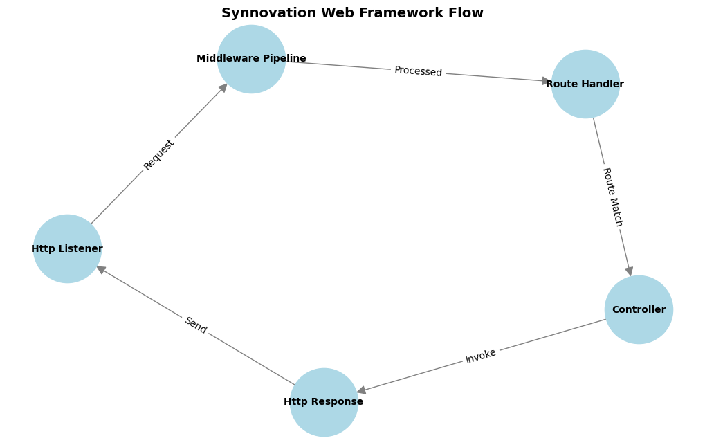

# Synnovation Web Framework

Synnovation Web Framework is a lightweight, modular .NET web framework designed for educational and practical purposes.
It offers MVC and REST API capabilities with minimal overhead.

## Features

- **Routing**: Attribute-based routing (`[HttpGet]`, `[HttpPost]`, etc.).
- **Middleware Pipeline**: Chainable middleware for logging, authentication, and more.
- **Controllers**: Supports both MVC (view rendering) and API (JSON-based) controllers.
- **View Engine**: Simple templating system for rendering HTML views with placeholders.
- **Parameter Binding**: Automatically bind route parameters and request bodies (`[FromBody]` & `[FromQuery]`).

## Key Components

### 1. Middleware Pipeline

Middleware is executed sequentially to process requests. You can create custom middleware by inheriting from
`MiddlewareBase`.

Example:

```csharp
public class LoggingMiddleware : MiddlewareBase
{
    public override async Task<HttpResponse> InvokeAsync(HttpRequest request, Func<HttpRequest, Task<HttpResponse>> next)
    {
        Console.WriteLine($"Request: {request.Method} {request.Path}");
        var response = await next(request);
        Console.WriteLine($"Response: {response.StatusCode}");
        return response;
    }
}
```

### 2. Routing

Attribute routing maps HTTP methods and paths to controller actions.

Example:

```csharp
[HttpGet("/api/users")]
public IActionResult GetAllUsers() => Ok(new[] { "User1", "User2" });
```

### 3. Controllers

Controllers inherit from either:

* `MvcControllerBase` for rendering views.
* `ApiControllerBase` for returning JSON or other types.

### 4. View Engine

The `ViewEngine` renders `.html` templates using `ViewData`.

Example `Views/Hello.html`:

````html
<!DOCTYPE html>
<html>
<head><title>{{ Title }}</title></head>
<body>
<h1>{{ Message }}</h1>
</body>
</html>
````

Corresponding controller:

````csharp
public IActionResult Hello()
{
    ViewData["Title"] = "Welcome";
    ViewData["Message"] = "Hello, world!";
    return View("Hello");
}
````

### 5. Parameter Binding

Supports route placeholders and `[FromBody]` annotations for JSON binding.

Example:

````csharp
[HttpPut("/api/users/{id}")]
public IActionResult UpdateUser(int id, [FromBody] UserUpdateDto dto)
{
    // Update logic
    return Ok();
}
````

## Diagram

The diagram below illustrates the flow of a request through the Synnovation Web Framework. It provides a high-level
overview of how different components interact during the lifecycle of an HTTP request.

---


### Components and Flow

1. **Http Listener**  
   The entry point of the framework. It listens for incoming HTTP requests over a TCP connection, parses the raw request
   data into a structured `HttpRequest` object, and forwards it to the middleware pipeline.

2. **Middleware Pipeline**  
   This is a sequence of middleware components that can inspect, modify, or short-circuit the request/response cycle.
   Examples include:
    - **LoggingMiddleware**: Logs incoming requests and outgoing responses.
    - **AuthenticationMiddleware**: Checks for valid authentication headers for secured routes.

3. **Route Handler**  
   Matches the incoming request (method and path) to the appropriate route defined in the `RouteTable`. Once a match is
   found, it invokes the corresponding controller action, passing in any required parameters (e.g., route placeholders
   or JSON body).

4. **Controller**  
   Executes the matched action. Depending on the type of controller:
    - **MVC Controllers** (`MvcControllerBase`): Render HTML views via the `ViewEngine`.
    - **API Controllers** (`ApiControllerBase`): Return structured responses, such as JSON or status codes (e.g., `Ok`,
      `BadRequest`).

5. **Http Response**  
   Constructs the final response object with headers, status codes, and content. This response is sent back to the Http
   Listener for delivery to the client.

6. **Client**  
   Receives the final HTTP response.

### HTML Placeholders

**ViewData values**

```html
{{ Key }}
```

* A placeholder is used to insert dynamic data from the `ViewData` dictionary into your HTML file.
* The `Key` corresponds to a property or key in `ViewData`

Example:

```html
<p>Welcome, {{ Username }}!</p>
```

**Conditionals**

```html
{{#if IsLoggedIn}}
<p>Welcome back!</p>
{{/if}}
```

**Loops**

````html

<ul>
    {{#foreach Item in Items}}
    <li>{{ Item }}</li>
    {{/foreach}}
</ul>
````

Sounds simple, right? I'd like to thank Lars Willemsen for the support in this project. It was a very fun, interesting,
and insightful project.